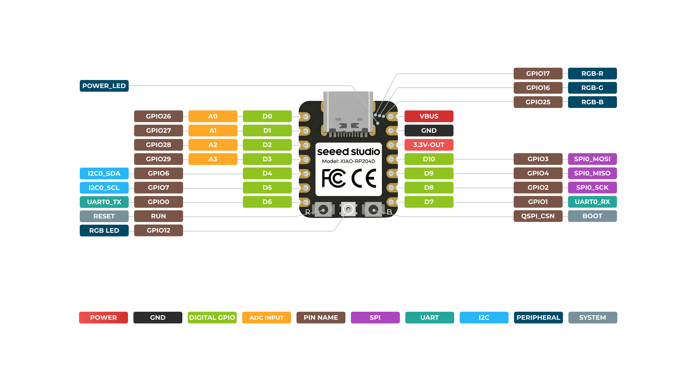

Other than the JP for al the pins on the borard here is the pinout:

|-      |left   | right
|-      | -     |-|
top     |Button4-D3 + led1 + Hole1-D4   |Button1- D0 + led1 + Hole4-D8|
bototm  |Button3-D2 + led1 + Hole2-D5   |Button2-D1 + led1 + Hole3-D7|
Led chain D6

To activate a hole as GPIO, solder its 1 kΩ resistor (H1 uses R1, etc.). Do not populate these resistors when the holes are used as mounting holes.

## Pinout:

