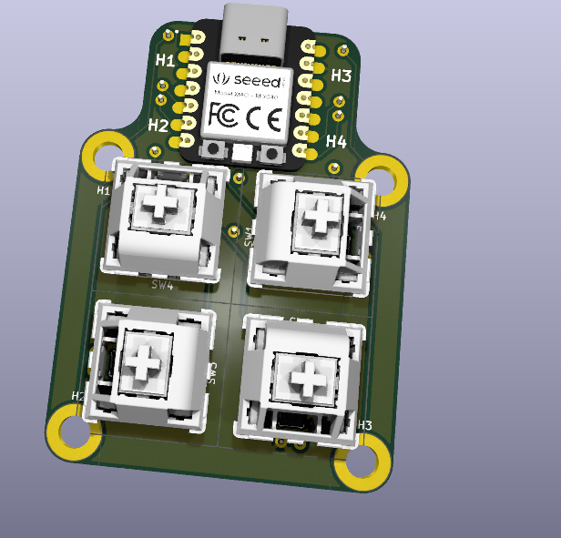
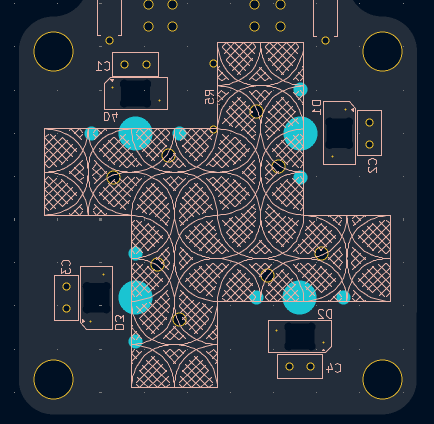
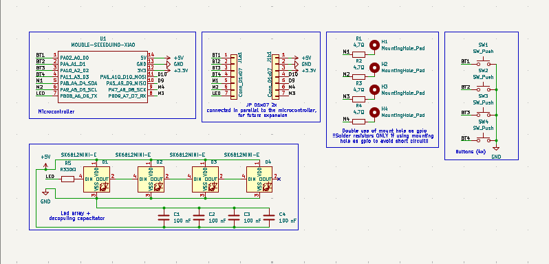
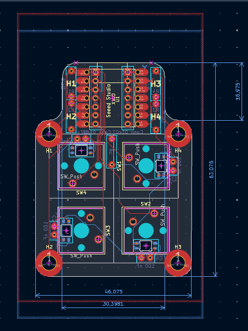
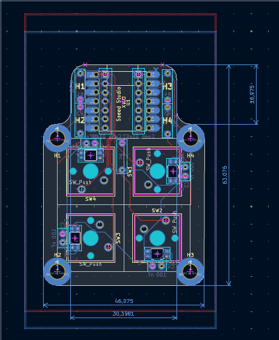
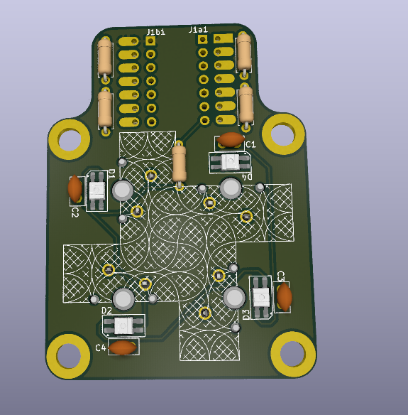

# Pathfinder\_Fidget\_RGB\_Macropad

A custom 4-key RGB fidget game / macropad /carrier board for seed studio XIAO
[Prices screenshot](https://github.com/LeoMos10/Pathfinder_Fidget_RGB_Macropad/tree/main/ASSETS/prices)

## Parts: (all THT for easier assembly exept led)

* 4x Cherry MX style switches + keycaps(transparent for better effect)
* 4x SK6812MINI-E addressable RGB LEDs, one per each key
* Seeed Studio XIAO RP2040 microcontroller, mounted flat on the front of the board
* 2 layer PCB,  46mm x 63mm
* 2  JP pin header (optional for expanding the board)(2,5mm)
* 2 JP pin header (optiona for easier mounting the XIAO)(2,5mm)
* 4 ceramic condensator 100nF
* 5 resistors (1 × 330 Ω + 4 × 1 kΩ only if using mount holes as GPIO)
*  4x M4 screws (only if using mount hole as indeed)

###  PCB

The pbc was made in KiCad.

board:  46mm x 63mm

[interactive HTML mount guide (made with a KiCad extension)](production/ibom.html)

### Schematic

### PCB

Front copper and back copper in the editor (red is F.Cu, blue is B.Cu):

3D renders of the board:

## Firmware
[DOCS](DOCS.md)

## BOM
[CSV BOM with prices and links](production/bom.csv)
[Prices screenshot](https://github.com/LeoMos10/Pathfinder_Fidget_RGB_Macropad/tree/main/ASSETS/prices)

| Quantity | Name | Component| Footprint | Notes | 
| :-: | :--- | :--- | :--- | :--- | 
| 1 | U1 | Seeed Studio XIAO RP2040 | Modulo XIAO RP2040, 14 pin, passo 2.54 mm | Microcontrolloer| [seeedstudio.com](https://www.seeedstudio.com/XIAO-RP2040-p-5058.html) |
| 2 | J1a1, J1b1 | Pin header male 1×7 |  2.54 mm, vertical, THT | Optional| — |
| 4 | SW1–SW4 | Switch Cherry MX compatibile | PCB-mount, 5 pin, 1u | Switch| — |
| 4 | D1–D4 | SK6812MINI-E | RGB addressable, reverse-mount, 3.2 × 2.8 mm | LED RGB| — |
| 4 | C1–C4 | cermaic condesator 100 nF | THT, passo 2.50 mm, diametro 5 mm | Decopuling for led| — |
| 4 | R1–R4 | 1 kΩ resistor | 7.62 mm | Only if using mount holes as GPIO | — |
| 1 | R5 | Resistence 330 Ω | 7.62 mm | In serie sulla linea DIN dei LED | — |
| 4 | H1–H4 | screw M4 | 4.3 mm | Only if using mount holes as indeed | — |

- USE `SK6812MINI-E` reverse-mount, NOT `SK6812MINI`

total price:
with shipping and taxes:

## AI usage

AI was never used for:

* schematic design
* PCB design

*instead, it was used a little for:
*firmware and code

the drc rule
HARDWARE/kicad/path_finder.kicad_dru
## Extra stuff

easily soldable, perfect for beginners in soldering and coding

see [docs](DOCS.md)
